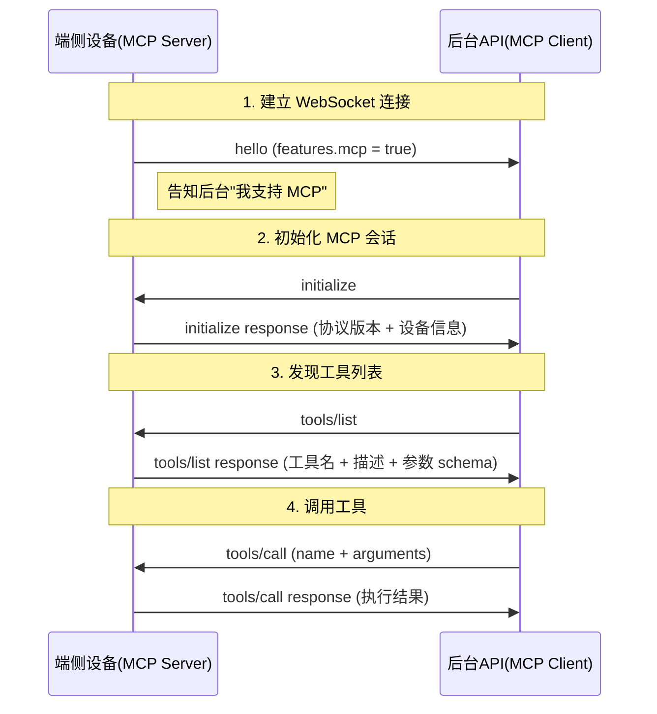

# MCP 协议交互示意文档

## 一、MCP 是什么

MCP（Model Context Protocol）是小智项目中用于**后台 API（Client）与端侧设备（Server）**之间通信的协议。它让后台能够发现和调用设备上的"工具"（Tool），比如控制机器人导航、查询 POI 等。

协议内部基于 **JSON-RPC 2.0** 规范，封装在 WebSocket/MQTT 的消息体中。

## 二、角色划分

| 角色 | 说明 | 项目中的实现 |
|------|------|---------------|
| MCP Client（客户端） | 后台 API，负责发起请求 | Go/Java 后端服务 |
| MCP Server（服务器） | 端侧设备，负责响应请求 | ESP32 固件 / Web 前端 Mock |

## 三、协议消息格式

每条 MCP 消息都封装在 WebSocket 消息中，结构如下：

```json
{
  "session_id": "xxx",
  "type": "mcp",
  "payload": {
    "jsonrpc": "2.0",
    "method": "xxx",
    "params": {},
    "id": 1
  }
}
```

- `type: "mcp"` 用于区分普通音频/TTS 消息
- `payload` 是标准 JSON-RPC 2.0 格式
- Request 有 `method` + `id`，Response 有 `result`/`error` + `id`

## 四、完整交互流程



## 五、各阶段详解

### 阶段 1：能力通告（hello）

端侧连接 WebSocket 后，发送 hello 消息，其中 `features.mcp: true` 告知后台"我支持 MCP"。

**端侧发送：**

```json
{
  "type": "hello",
  "version": 1,
  "transport": "websocket",
  "features": { "mcp": true },
  "audio_params": { "format": "opus", "sample_rate": 16000, "channels": 1, "frame_duration": 60 }
}
```

后台收到后，如果看到 `mcp: true`，就知道可以对这个设备发 MCP 请求。

---

### 阶段 2：初始化（initialize）

后台确认设备支持 MCP 后，发起初始化握手。

**后台发送：**

```json
{
  "session_id": "xxx",
  "type": "mcp",
  "payload": {
    "jsonrpc": "2.0",
    "method": "initialize",
    "params": { "capabilities": {} },
    "id": 1
  }
}
```

**端侧响应：**

```json
{
  "session_id": "xxx",
  "type": "mcp",
  "payload": {
    "jsonrpc": "2.0",
    "id": 1,
    "result": {
      "protocolVersion": "2024-11-05",
      "capabilities": { "tools": {} },
      "serverInfo": { "name": "xiaozhi-web-mock", "version": "1.0.0" }
    }
  }
}
```

---

### 阶段 3：发现工具列表（tools/list）

后台获取设备提供了哪些工具，以及每个工具的参数定义。

**后台发送：**

```json
{
  "session_id": "xxx",
  "type": "mcp",
  "payload": {
    "jsonrpc": "2.0",
    "method": "tools/list",
    "params": { "cursor": "" },
    "id": 2
  }
}
```

**端侧响应：**

```json
{
  "session_id": "xxx",
  "type": "mcp",
  "payload": {
    "jsonrpc": "2.0",
    "id": 2,
    "result": {
      "tools": [
        {
          "name": "self.robot.navigate",
          "description": "导航到指定地点",
          "inputSchema": {
            "type": "object",
            "properties": { "poi_name": { "type": "string" } },
            "required": ["poi_name"]
          }
        },
        {
          "name": "self.robot.query_poi",
          "description": "返回全部 POI 列表",
          "inputSchema": { "type": "object", "properties": {}, "required": [] }
        },
        {
          "name": "self.robot.current_pose",
          "description": "返回机器人当前位姿",
          "inputSchema": { "type": "object", "properties": {}, "required": [] }
        }
      ]
    }
  }
}
```

---

### 阶段 4：调用工具（tools/call）

后台实际调用某个工具，端侧执行后返回结果。

**后台发送：**

```json
{
  "session_id": "xxx",
  "type": "mcp",
  "payload": {
    "jsonrpc": "2.0",
    "method": "tools/call",
    "params": {
      "name": "self.robot.query_poi",
      "arguments": {}
    },
    "id": 3
  }
}
```

**端侧响应（成功）：**

```json
{
  "session_id": "xxx",
  "type": "mcp",
  "payload": {
    "jsonrpc": "2.0",
    "id": 3,
    "result": {
      "content": [{ "type": "text", "text": "{\"mapPoi\":[...]}" }],
      "isError": false
    }
  }
}
```

**端侧响应（失败 — 工具不存在）：**

```json
{
  "session_id": "xxx",
  "type": "mcp",
  "payload": {
    "jsonrpc": "2.0",
    "id": 3,
    "error": { "code": -32601, "message": "Unknown tool: self.xxx" }
  }
}
```

## 六、端侧开发要点

1. hello 中声明 `features.mcp: true`
2. 监听 `type: "mcp"` 的消息
3. 根据 `payload.method` 分发处理
4. 响应时 `id` 必须与请求一致（JSON-RPC 匹配机制）
5. `tools/call` 的结果固定包裹在 `content: [{ type: "text", text: "..." }]` 中

## 七、后台开发要点

1. 收到 hello 中 `mcp: true` 后，才对该设备发起 MCP 请求
2. 先 `initialize` → 再 `tools/list` → 然后才能 `tools/call`
3. 每个请求带唯一递增的 `id`，用于匹配响应
4. 支持分页：如果 `tools/list` 响应中有 `nextCursor`，需再次请求
5. 工具调用的 `arguments` 必须符合工具的 `inputSchema` 定义

## 八、前端 Mock 实现位置

- 开关存储：`localStorage("xiaozhi_mcp_enabled")`
- 消息处理：`src/composables/useWebSocket.ts` 中的 `handleMcpMessage` 函数
- 工具列表和模拟数据都硬编码在该函数中

---

## 九、完整链路详解（以真实设备视角）

以下从设备开机到完成一次工具调用的完整链路：

```
┌─────────────────────────────────────────────────────────────────┐
│ 阶段 1：设备上线，建立连接                                        │
├─────────────────────────────────────────────────────────────────┤
│                                                                 │
│  ESP32 开机                                                      │
│    ↓                                                            │
│  连接 WiFi                                                       │
│    ↓                                                            │
│  建立 WebSocket 连接到后台                                        │
│    ↓                                                            │
│  发送 hello 消息：                                                │
│  {                                                              │
│    "type": "hello",                                             │
│    "version": 1,                                                │
│    "transport": "websocket",                                    │
│    "features": { "mcp": true },  ← 关键：声明支持 MCP             │
│    "audio_params": { ... }                                      │
│  }                                                              │
│    ↓                                                            │
│  后台回复 hello：                                                 │
│  {                                                              │
│    "type": "hello",                                             │
│    "session_id": "abc123..."   ← 后台分配会话 ID                  │
│  }                                                              │
│    ↓                                                            │
│  设备保存 session_id，连接就绪                                     │
│                                                                 │
└─────────────────────────────────────────────────────────────────┘

┌─────────────────────────────────────────────────────────────────┐
│ 阶段 2：MCP 初始化                                               │
├─────────────────────────────────────────────────────────────────┤
│                                                                 │
│  后台看到 features.mcp = true                                    │
│    ↓                                                            │
│  后台发送 initialize 请求：                                       │
│  {                                                              │
│    "session_id": "abc123...",                                   │
│    "type": "mcp",                                               │
│    "payload": {                                                 │
│      "jsonrpc": "2.0",                                          │
│      "method": "initialize",                                    │
│      "params": { "capabilities": {} },                          │
│      "id": 1                                                    │
│    }                                                            │
│  }                                                              │
│    ↓                                                            │
│  设备收到，回复自身信息：                                          │
│  {                                                              │
│    "session_id": "abc123...",                                   │
│    "type": "mcp",                                               │
│    "payload": {                                                 │
│      "jsonrpc": "2.0",                                          │
│      "id": 1,             ← id 必须与请求一致                     │
│      "result": {                                                │
│        "protocolVersion": "2024-11-05",                         │
│        "capabilities": { "tools": {} },                         │
│        "serverInfo": {                                          │
│          "name": "ESP32-Robot",  ← 设备名称                      │
│          "version": "1.2.0"      ← 固件版本                      │
│        }                                                        │
│      }                                                          │
│    }                                                            │
│  }                                                              │
│    ↓                                                            │
│  后台确认：初始化成功，协议版本兼容                                  │
│                                                                 │
└─────────────────────────────────────────────────────────────────┘

┌─────────────────────────────────────────────────────────────────┐
│ 阶段 3：后台获取工具列表                                          │
├─────────────────────────────────────────────────────────────────┤
│                                                                 │
│  后台发送 tools/list 请求：                                       │
│  {                                                              │
│    "session_id": "abc123...",                                   │
│    "type": "mcp",                                               │
│    "payload": {                                                 │
│      "jsonrpc": "2.0",                                          │
│      "method": "tools/list",                                    │
│      "params": { "cursor": "" },                                │
│      "id": 2                                                    │
│    }                                                            │
│  }                                                              │
│    ↓                                                            │
│  设备遍历自己注册的所有工具，构造列表返回：                          │
│  {                                                              │
│    ...                                                          │
│    "payload": {                                                 │
│      "jsonrpc": "2.0",                                          │
│      "id": 2,                                                   │
│      "result": {                                                │
│        "tools": [                                               │
│          {                                                      │
│            "name": "self.robot.navigate",                       │
│            "description": "导航到指定地点",                       │
│            "inputSchema": {                                     │
│              "type": "object",                                  │
│              "properties": { "poi_name": { "type": "string" } },│
│              "required": ["poi_name"]                            │
│            }                                                    │
│          },                                                     │
│          { "name": "self.robot.query_poi", ... },               │
│          { "name": "self.robot.current_pose", ... }             │
│        ]                                                        │
│      }                                                          │
│    }                                                            │
│  }                                                              │
│    ↓                                                            │
│  后台缓存工具列表，知道这个设备能做什么                             │
│  后台把工具描述注入 AI 的 system prompt，让 AI 知道可以调哪些工具    │
│                                                                 │
└─────────────────────────────────────────────────────────────────┘

┌─────────────────────────────────────────────────────────────────┐
│ 阶段 4：用户触发工具调用                                          │
├─────────────────────────────────────────────────────────────────┤
│                                                                 │
│  用户对小智说："帮我查一下附近有哪些地方"                            │
│    ↓                                                            │
│  AI 分析意图，决定调用 self.robot.query_poi                       │
│    ↓                                                            │
│  后台发送 tools/call：                                            │
│  {                                                              │
│    "session_id": "abc123...",                                   │
│    "type": "mcp",                                               │
│    "payload": {                                                 │
│      "jsonrpc": "2.0",                                          │
│      "method": "tools/call",                                    │
│      "params": {                                                │
│        "name": "self.robot.query_poi",                          │
│        "arguments": {}        ← 该工具无参数                     │
│      },                                                         │
│      "id": 3                                                    │
│    }                                                            │
│  }                                                              │
│    ↓                                                            │
│  ESP32 收到请求                                                   │
│    ↓                                                            │
│  根据 name 找到对应的处理函数                                      │
│    ↓                                                            │
│  ┌───────────────────────────────────────────┐                  │
│  │ 调用真实的机器人 SDK / 硬件 API：           │                  │
│  │   robot_sdk.get_map_pois()                │                  │
│  │     → 从底盘控制器读取地图数据              │                  │
│  │     → 返回 POI 列表                        │                  │
│  └───────────────────────────────────────────┘                  │
│    ↓                                                            │
│  拿到真实数据，序列化为 JSON 字符串                                 │
│    ↓                                                            │
│  封装成 JSON-RPC response 发回后台：                               │
│  {                                                              │
│    "session_id": "abc123...",                                   │
│    "type": "mcp",                                               │
│    "payload": {                                                 │
│      "jsonrpc": "2.0",                                          │
│      "id": 3,                                                   │
│      "result": {                                                │
│        "content": [{                                            │
│          "type": "text",                                        │
│          "text": "{\"mapPoi\":[{\"name\":\"前台\",...},...]}"     │
│        }],                                                      │
│        "isError": false                                         │
│      }                                                          │
│    }                                                            │
│  }                                                              │
│    ↓                                                            │
│  后台拿到结果，交给 AI 处理                                        │
│    ↓                                                            │
│  AI 用自然语言回复用户：                                           │
│  "附近有前台、机房、716会议室、茶水间等地方，你想去哪里？"            │
│                                                                 │
└─────────────────────────────────────────────────────────────────┘
```

### 关键理解

整个链路中各方的职责：

| 参与方 | 职责 |
|--------|------|
| 用户 | 用自然语言表达意图 |
| AI（大模型） | 理解意图 → 决定调哪个工具 → 将工具结果转为自然语言 |
| 后台 API | 转发 AI 的工具调用请求到设备，转发设备结果回 AI |
| 端侧设备 | 执行真实操作（调硬件 API），返回结果数据 |

数据流向：

```
用户语音 → 后台 STT → AI 推理 → 后台发 tools/call → 设备执行 → 设备返回结果
    → 后台把结果给 AI → AI 生成回复 → 后台 TTS → 用户听到语音回答
```

---

参考文档：https://xiaozhi.dev/docs/development/mcp/protocol/
